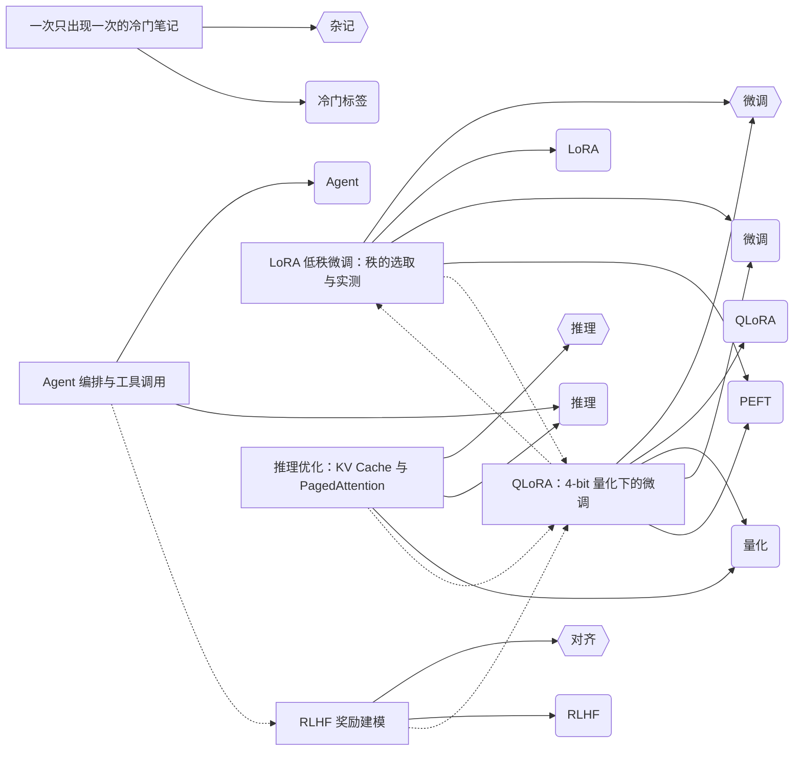

# md-knowledge-graph

指一个 markdown 目录给它，它产出三样东西：**知识图谱**、**知识库检查报告**、**相关文章数据**。

与框架无关——读的是 markdown 源文件，不需要先 build。

[](https://github.com/meiluosi/md-knowledge-graph/actions/workflows/ci.yml)


> 它守的是**那种不会喊叫的失效**：链接指向的章节被改名了、标签写法前后不一致、
> 文章被删了但引用还在。这些都不会让任何东西崩，只会让知识库慢慢烂掉。
> `--check` 把它们变成一条非零退出码。

---

## 它做什么

```bash
mdkg --posts ./content --out graph.json            # 图
mdkg --posts ./content --check                     # 检查（退出码可进 CI）
mdkg --posts ./content -f related -o related.json  # 相关文章
```

图里有三种边：文章→标签、文章→分类，以及**文章→文章**（正文里写的链接，含 `[[wikilink]]`）。

检查的重点是**那些不会喊叫的失效**：

| 检查项 | 级别 | 典型场景 |
|---|---|---|
| **失效锚点** | 错误 | `[契约](design.md#api-contract)` —— 章节改名了，文件还在，链接已经死了 |
| **正文断链** | 错误 | 引用的文件被删或路径写错 |
| frontmatter 解析失败 | 错误 | YAML 语法错误 |
| 无标签文章 / 只出现一次的标签 | 警告 | 长尾标签，靠分类或引用才连得上 |
| 标签写法不一致 | 警告 | `PEFT` 与 `peft` 会被合并，确认不是笔误 |
| 孤立节点 / 自引用 | 警告 | 图里的孤岛 |

锚点校验按 GitHub 的 slug 规则（用 `github-slugger`，参考实现）。渲染器规则不同的站点用 `--no-anchor-check` 关掉。

### 但它可能一开就红 —— 所以有基线

一个攒了 40 条历史断链的知识库，第一次跑 `--check` 拿到 40 个错误、退出码 1。**人不会去修那 40 条——他会在 CI 里删掉这一步。** 门禁就是这样死的。

基线把已知问题冻结下来，**只有新增问题才失败**：

```bash
mdkg --posts content --update-baseline .mdkg-baseline.json   # 接入时做一次
mdkg --posts content --check --baseline .mdkg-baseline.json  # 之后一直用这个
```

```
$ mdkg --posts content --check --baseline .mdkg-baseline.json
✓ 没有新增问题（40 项已知问题仍在基线里）
错误 0 · 警告 0  ·  已知 40 项已忽略                        ← 退出码 0

# 后来引入一条新断链 —— 只报它：
✗ 正文断链 —— 1 项（另有 1 项已知，已忽略）
    new  →  ./nope.md
错误 1 · 警告 0  ·  已知 40 项已忽略                        ← 退出码 1

# 修好的旧问题会被识别出来，提示你清理基线：
ℹ 基线里有 1 项已不再出现：broken-link|a|./deleted.md
```

基线文件是 **JSON、按 key 排序、可以人工 review** 的，该提交进仓库：

```json
{ "schemaVersion": 1, "generatedBy": "md-knowledge-graph@0.4.0", "count": 9,
  "issues": [ { "key": "broken-anchor|a|b|flash-attention", "code": "broken-anchor",
                "severity": "error", "message": "a  →  b  #flash-attention" } ] }
```

`key` 只依赖问题本身——**不含行号、顺序、措辞、计数**。插一篇无关文章、或工具改一次提示文案，都不会让整份基线失效。这是它能用下去的前提。

## Quickstart

```bash
git clone https://github.com/meiluosi/md-knowledge-graph.git
cd md-knowledge-graph && npm install
npm run example        # → examples/graph.json
```

自带 `examples/` 语料，所以上面这条不依赖任何私有数据。

## 用法

| 选项 | 说明 | 默认 |
|---|---|---|
| `-p, --posts <dir>` | 语料目录，递归读取 `.md` / `.mdx` | `examples` |
| `-o, --out <file>` | 输出文件；省略则写 stdout | — |
| `-f, --format <fmt>` | 出图：`json` \| `mermaid` \| `html` \| `related`<br>检查：`text` \| `json` \| `github` | `json` / `text` |
| `--min-tag-count <n>` | 标签出现次数低于 n 不入图 | `2` |
| `--max-nodes <n>` | 节点数上限 | `200` |
| `--no-link-edges` | 不生成正文引用边 | — |
| `--no-anchor-check` | 不校验 `#锚点` 是否存在 | — |
| `--post-url` / `--tag-url` / `--category-url` | URL 模板，如 `/posts/{id}/` | — |
| `--check` / `--strict` | 只跑检查；`--strict` 让警告也算失败 | — |
| `--baseline <file>` | 只对**新增**问题失败 | — |
| `--update-baseline <file>` | 把当前全部问题写成基线（总是退出 0） | — |
| `--related-top` / `--related-min-score` | 相关文章数量与阈值 | `5` / `1` |

**退出码**：`0` 正常或检查无错误；`1` 参数/语料错误，或检查发现错误。

## 输出

<details>
<summary><b>图</b>（点击展开 —— 实线是归属，虚线是引用）</summary>



</details>

**检查报告** —— 示例语料故意留了缺陷，所以这段是真实可复现的：

```
$ mdkg --posts examples --check
✗ 正文断链（目标文件不存在） —— 1 项
    2026-01-08-qlora-4bit  →  ./2026-01-01-deleted-draft.md
✗ 失效锚点（文件存在，但章节不存在） —— 2 项
    2026-01-08-qlora-4bit  →  2026-01-15-inference-kvcache  #flash-attention
    2026-01-08-qlora-4bit  →  （本文）  #不存在的小节
⚠ 只出现一次的标签 —— 5 项
⚠ 写法不一致的标签 —— 1 项     PEFT / peft  →  合并为「peft」，共 2 篇
错误 3 · 警告 6  →  退出码 1
```

同样的语料里还有**有效**的锚点（`#kv-cache`、`#pagedattention`、`#react`）和代码块里的**假**锚点——两者都不会被报出来。这是刻意的：误报会让门禁被关掉。

**相关文章** —— 带 `schemaVersion`，可直接给博客的「相关阅读」消费：

```json
{ "schemaVersion": 1, "posts": [
  { "id": "2026-01-19-agent-orchestration",
    "related": [ { "id": "2026-01-12-rlhf-reward", "score": 3, "reasons": ["link"] } ] } ] }
```

打分：正文引用 +3 / 被引用 +3 / 每个共享标签 +2 / 同分类 +1。同分按 id 升序，**保证顺序确定**——否则每次跑出来的"相关阅读"都在变，没法对比。

`--format html` 另有一个自包含、离线可用的力导向图（单文件、无 CDN、可拖拽），适合当调试预览。

## 与现有工具的差别

这个领域分项都有强手，但交集是空的：

| 工具 | 形态 | 它做了哪部分 | 局限 |
|---|---|---|---|
| Obsidian / Logseq / Dendron | 桌面应用 | 图谱、wikilink | 笔记要迁进它的 vault；不给你数据 |
| [Foam](https://github.com/foambubble/foam) | VS Code 扩展 | 同上 | 绑定编辑器 |
| [Quartz](https://quartz.jzhao.xyz/) | 静态站点生成器 | 图谱页面 | 得把站点迁到它上面 |
| [lychee](https://github.com/lycheeverse/lychee) / linkinator | CLI | 断链 | 只查链接，不产出图与相关文章 |
| Hugo `.Related` / Jekyll 插件 | 框架内建 | 相关文章 | 只在那个框架里 |
| [remark-wiki-link](https://www.npmjs.com/package/remark-wiki-link) | 库 | 解析 wikilink | 只解析 |

**mdkg 的差异是：框架无关 + 读到锚点一级 + 一次产出三种数据。**

"读到锚点一级"是它跟链接检查工具真正分开的地方——lychee 那一类验的是**链接能不能打开**，而这里验的是**引用还在不在**：文件在、章节改名了，它照样报错。规格文档最常见的失效正是这一类。

它不跟 Obsidian 抢可视化，也不跟 lychee 抢全站链接爬取。

## 集成

### GitHub Action

```yaml
- uses: meiluosi/md-knowledge-graph@v0.5.0
  with:
    posts: content
    baseline: .mdkg-baseline.json   # 可选：只对新增问题失败
    strict: "false"                 # 可选：true 时警告也算失败
```

不需要先 `npm install`——action 自己装依赖。

问题以 **GitHub 注解**的形式直接挂在 PR 的 *Files changed* 里对应文件上，不必翻日志：

```
::error file=content/design.md,title=失效锚点（文件存在，但章节不存在）::tasks → design #api-contract
```

另外返回三个输出，可在后续步骤里用：

| 输出 | 含义 |
|---|---|
| `errors` | 新增错误数 |
| `warnings` | 新增警告数 |
| `known` | 被基线忽略的已知问题数 |

**已知限制**：注解只定位到文件，没有行号。行号需要在剥离代码块前后维持偏移映射，代价不小；而**错的行号比没有行号更糟**，所以先不做。

### pre-commit

```yaml
repos:
  - repo: https://github.com/meiluosi/md-knowledge-graph
    rev: v0.5.0
    hooks:
      - id: md-knowledge-graph
        args: [--posts, content, --check]
```

钩子用 `pass_filenames: false`，因为本工具需要**整份语料**才能判断链接指向是否存在——只给它改动过的文件是判不了的。

### 任意 CI

```yaml
- run: npx md-knowledge-graph --posts content --check --baseline .mdkg-baseline.json
```

### 给 agent 用

`--check --format json` 输出结构化结果——每个条目带 `key` 与各自的字段，**不需要正则解析**：

```json
{
  "schemaVersion": 1,
  "summary": { "errors": 1, "warnings": 0, "knownIgnored": 40, "staleBaselineEntries": 0 },
  "groups": [
    {
      "code": "broken-anchor",
      "severity": "error",
      "count": 1,
      "items": [
        { "key": "broken-anchor|tasks|design|api-contract",
          "from": "tasks", "to": "design", "anchor": "api-contract", "sameFile": false,
          "message": "tasks  →  design  #api-contract" }
      ]
    }
  ]
}
```

配合基线，agent 拿到的就是**「你这次的改动引入了什么」**，而不是一百条它不该管的旧账。

## What didn't work

开发中真正踩过的坑，完整版见 [`docs/what-didnt-work.md`](./docs/what-didnt-work.md)。最值得记的三条：

- **手写 frontmatter 解析器静默丢数据**：`tags: [A, B]` 和 `tags: A` 都会变成 `[]`，且不报错。这就是引入 `gray-matter` 的原因。
- **同概念两种写法产出畸形图**：`PEFT` 与 `peft` 曾经生成两个 **id 相同**的节点，破坏图的完整性，而不是"多一个点"。修复后又发现检查器用了另一套口径——**它一边警告"会合并"，一边按两种拼写各报一次**。
- **我把测试断言写错过两次**，两次都差点去改一个本来正确的实现。所以：测试失败时，先怀疑测试。

## 已知取舍

- 不做 `tag ↔ tag` 共现边（数量是标签数的平方级，语料一大图就糊）
- 链接目标同名时**宁可判为断链**，也不猜一个
- 锚点按 **GitHub 的 slug 规则**（`github-slugger`）；渲染器规则不同的站点请用 `--no-anchor-check`
- 锚点不覆盖 HTML 里手写的 `<h2 id="...">`；Setext 标题（下划线式）支持
- Mermaid 输出不适合超过约 100 个节点，那个规模用 `--format html`
- 不提取正文里的实体或关键词；相关文章不做全局图算法（PageRank、社区发现）
- 只检查本地语料内的引用，不发起网络请求验证外部链接
- **依赖说清楚**：2 个直接依赖，安装后共 **11 个依赖包**。`github-slugger` 零传递依赖；`gray-matter` 带进 9 个传递依赖。选它是因为自研 frontmatter 解析会**静默丢数据**——见 [`docs/what-didnt-work.md`](./docs/what-didnt-work.md)

## License

[MIT](./LICENSE)
