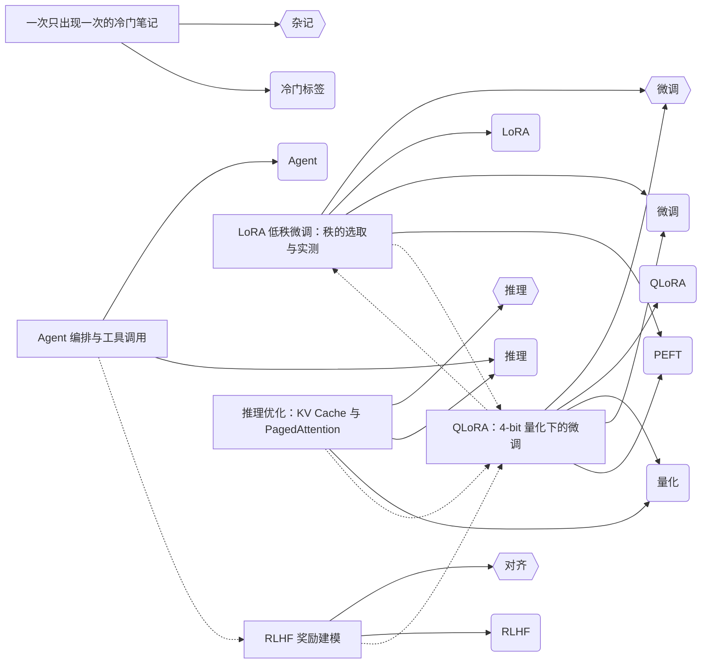

# md-knowledge-graph

从**任意 markdown 目录**构建知识图谱，并检查你的知识库。

三种产物：**图**（文章 ↔ 标签 ↔ 分类，外加文章之间的相互引用）、**检查报告**（可进 CI）、**相关文章数据**（可直接被博客消费）。

[](https://github.com/meiluosi/md-knowledge-graph/actions/workflows/ci.yml)


---

## Result

### 1. 图

`--format mermaid` 直接输出下面这张图，贴进 README 即可渲染，**无需截图**。

**实线**是归属边（`post → tag` / `post → category`），**虚线**是文章之间的引用（`post → post`）：



`--format html` 产出**自包含、离线可用**的力导向图：单文件、无 CDN、无外部字体，双击即可打开，节点可拖拽。引用边用洋红色与归属边区分。

### 2. 检查报告

`--check` 会让**断链导致退出码为 1**，因此可以直接挂进 CI。仓库自带的示例语料故意留了缺陷，所以下面这段输出是真实可复现的：

```
$ node src/cli.js --posts examples --check
检查报告 · examples
────────────────────────
✗ 正文断链 —— 1 项
    2026-01-08-qlora-4bit  →  ./2026-01-01-deleted-draft.md  (markdown)
    ↳ 链接指向的文章在语料里找不到。检查路径拼写，或该文章是否已被删除。

⚠ 只出现一次的标签（低于 --min-tag-count 2，不入图） —— 5 项
    LoRA  (1 次)
    QLoRA  (1 次)
    ...

⚠ 写法不一致的标签（已按 slug 合并为同一个节点） —— 1 项
    PEFT  /  peft  →  合并为「peft」，共 2 篇

────────────────────────
错误 1 · 警告 6  → 存在错误，退出码 1
```

跑自己的代码库时若退出码为 0，就说明没有断链。

### 3. 相关文章

`--format related` 输出的 JSON 可以直接喂给博客的「相关阅读」模块：

```json
{
  "schemaVersion": 1,
  "posts": [
    {
      "id": "2026-01-19-agent-orchestration",
      "title": "Agent 编排与工具调用",
      "related": [
        { "id": "2026-01-12-rlhf-reward", "score": 3, "reasons": ["link"] },
        { "id": "2026-01-15-inference-kvcache", "score": 2, "reasons": ["tag:推理"] }
      ]
    }
  ]
}
```

带 `schemaVersion`，下游可以据此判断契约是否变化。

---

## Quickstart

```bash
git clone https://github.com/meiluosi/md-knowledge-graph.git
cd md-knowledge-graph
npm install
npm run example          # → examples/graph.json
```

跑你自己的语料：

```bash
# 出一张图
node src/cli.js --posts /path/to/your/notes --out graph.json

# 检查（可在 CI 里当门禁）
node src/cli.js --posts ./content --check

# 生成相关文章
node src/cli.js --posts ./content --format related --out related.json
```

**验收标准：从 clone 到出图，10 分钟以内。** 仓库自带 `examples/` 语料，Quickstart 不依赖任何私有数据。

## Install

```bash
npm install md-knowledge-graph
npx mdkg --posts ./content --out graph.json
```

要求 Node ≥ 18.3（用到内置的 `node:util` `parseArgs` 与 `node:test`）。

## 用法

| 选项 | 说明 | 默认 |
|---|---|---|
| `-p, --posts <dir>` | 语料目录，递归读取 `.md` / `.mdx` | `examples` |
| `-o, --out <file>` | 输出文件；省略则写 stdout | — |
| `-f, --format <fmt>` | `json` \| `mermaid` \| `html` \| `related` | `json` |
| `--min-tag-count <n>` | 标签出现次数低于 n 则不入图 | `2` |
| `--max-nodes <n>` | 节点数上限，超出按「分类全留 + 标签按频次」裁剪 | `200` |
| `--no-link-edges` | 不生成正文引用边（适合节点多、只想看主题结构时） | — |
| `--post-url <tpl>` | 文章 URL 模板，如 `/posts/{id}/` | — |
| `--tag-url <tpl>` | 标签 URL 模板，如 `/tags/{slug}/` | — |
| `--category-url <tpl>` | 分类 URL 模板，如 `/categories/{slug}/` | — |
| `--related-top <n>` | 每篇保留几篇相关文章 | `5` |
| `--related-min-score <n>` | 低于此分不输出 | `1` |
| `--check` | 只跑检查并打印报告 | — |
| `--strict` | 连警告也算失败（需与 `--check` 同用） | — |

**退出码**：`0` 正常 / 检查无错误；`1` 参数或语料错误，或检查模式下发现错误。

复刻一个 Astro 站点的 URL 结构：

```bash
node src/cli.js --posts src/content/posts \
  --post-url "/posts/{id}/" --tag-url "/tags/{slug}/" \
  --category-url "/categories/{slug}/" --out graph.json
```

## How it works

```
markdown 目录
   │  递归遍历（自带实现，不依赖 glob）
   ▼
gray-matter 解析 frontmatter ──► title / tags / category
   │  normalizeList() 把 数组 / 行内数组 / 标量 收敛成同一种结果
   │  aggregateBySlug() 把 PEFT / peft 这类写法合并成一个概念
   ▼
正文链接解析（去掉代码块后）
   │  相对 md 链接 · 站点绝对路径 · [[wikilink]]
   ▼
构图 ──► post→tag · post→category · post→post
   │  minTagCount 过滤长尾 → maxNodes 裁剪
   ▼
JSON / Mermaid / HTML / related
```

### 三种边

| 边 | 含义 | 权重来源 |
|---|---|---|
| `post → tag` | 主题归属 | — |
| `post → category` | 分类归属 | — |
| `post → post` | 正文里明确引用 | 相关文章打分 +3 |

**不生成 `tag ↔ tag` 共现边**：共现边数量是标签数的平方级，语料一大图就糊。当前实现选择让「同一篇文章」隐式表达共现关系。

### 相关文章怎么打分

| 信号 | 分值 |
|---|---|
| 正文引用（出链） | +3 |
| 被引用（入链） | +3 |
| 每个共享标签 | +2 |
| 同一分类 | +1 |

互相引用会自然累加。结果按分数降序，同分按 id 升序——**保证确定性**，否则每次跑出来的 "相关阅读" 顺序都在变，没法对比。

### 链接解析的四种写法

| 写法 | 例子 |
|---|---|
| 同目录相对路径 | `[文字](./2026-01-08-qlora.md)` |
| 站点绝对路径 | `[文字](/posts/2026-01-08-qlora/)` |
| wikilink | `[[2026-01-08-qlora]]` 或 `[[slug\|显示文字]]` |
| 百分号编码的中文路径 | `/posts/2024-06-09-%E5%85%B3%E4%BA%8E.../` |

## What didn't work

这一节不是装饰。以下是**实际踩过**的坑和实测数据。

### 1. 手写 frontmatter 解析器会静默丢数据

本工具的前身是一个 51 行的、零依赖的手写 YAML 子集解析器。它在我自己的 33 篇文章上**从未出错**——因为那些文章恰好全用了块式数组。换几种同样合法的写法：

| frontmatter 写法 | 手写解析器结果 | |
|---|---|---|
| `tags:\n  - A\n  - B` | `["A", "B"]` | ✅ |
| `tags: [A, B]` | `[]` | ❌ **静默丢数据** |
| `tags: A` | `[]` | ❌ **静默丢数据** |

问题不在实现粗糙，而在**缺陷形态**：它对非法输入不报错，对合法输入也照样返回空数组。使用者拿到的是一张少了文章、却不报任何错的图。

**所以本项目引入了唯一的依赖 `gray-matter`。** 上面那三种写法现在是三条回归测试。

### 2. 同一概念的两种写法会产出「畸形图」，不是「多一个节点」

实现标签节点时按原写法直接建节点，于是 `PEFT` 和 `peft` 产生了**两个 id 完全相同、label 不同的节点**：

```
tag:peft("PEFT")
tag:peft("peft")     ← 同一个 id 出现两次
```

这不是"图上多一个点"那么轻——它破坏了图的完整性：Mermaid 里是重复定义，前端按 id 建索引会互相覆盖，下游拿到的边指向哪个节点取决于遍历顺序。

现在按 slug 归并（`aggregateBySlug`），计数的口径是「多少篇文章用了这个概念」，规范写法按**多数决**选出、并列时优先大写更多的那个（`PEFT` 优于 `peft`）。回归测试固化在 `test/graph.test.js` 的「同概念不同写法的归并」组里。

顺带一个教训：**检查和出图必须共用同一套归并逻辑**。最初检查器按原写法统计，于是它一边警告"会被合并成同一个节点"，一边又按两种拼写各报了一次——警告本身是错的。

### 3. 代码块里的示例链接会被当成真断链

技术文章里经常出现这种内容：

````markdown
参考 [示例](not-a-real-post.md) 的写法
````

第一版直接对全文做正则，于是所有**文档示例**都成了断链，一篇文章能报出十几条假错误。现在会先剥掉围栏代码块、行内代码和 HTML 注释（`stripCode`），只解析真正的正文链接。

### 4. wikilink 曾经永远连不上

`resolveTarget` 最初只做路径解析：`path.join(dirname(from.id), target)`。这对 `./a.md` 有效，但 `[[thing]]` 这种不带路径的目标永远解析不出结果——**功能看起来实现了，实际一条边都没产生**。

修复时加了一层"无斜杠目标按文件名查找"的回退，但有意的限制是：**这层回退只对不含 `/` 的目标启用**。否则 `./gone.md` 会因为别处恰好有个 `gone` 而被误判成有效链接，**把真正的断链掩盖掉**——检查器最不该做的事。

### 5. 我的测试断言写错过两次，而且两次都该先怀疑测试

**第一次**（`buildGraph`）：我断言"有分类但标签全被过滤的文章仍应入图"，但我构造的数据里那篇文章的 `category` 是空字符串——它本来就该被排除。**是断言错了，不是代码错了。**

**第二次**（`computeRelated`）：`minScore: 3` 时分数恰好是 3，阈值是闭区间、应该保留，我却断言成排除。

两次都差点让我去改一个本来正确的实现。所以：**测试失败时，先怀疑测试。**

### 6. 一个拼写事故：`Set.set` 不是 `Set.add`

写标签大小写检查时用了 `bySlug.get(key).set(name)`。冒烟测试立刻炸了：`bySlug.get(...).set is not a function`。

教训很小但很实际：**第一版跑起来看一眼，比读三遍代码便宜。** 这个 bug 单元测试抓不到——因为我当时还没写那部分测试；是"跑一下看看"抓到的。

### 7. 生成物也需要被测试

`--format html` 的输出是 HTML，语法正确不代表能跑。一个 NaN 坐标、一个漏掉的 canvas 方法，用户拿到的就是一张白屏，而只做语法检查的 CI 抓不到。

`test/html-runtime.test.js` 因此搭了一个最小 DOM stub，把内嵌脚本**真正执行一遍**，断言每个节点都被绘制、所有坐标都是有限值、画布按 DPR 正确放大。

`test/cli.test.js` 同理：**退出码是 CI 唯一真正依赖的契约**，单元测试全绿但退出码错了，CI 依然是坏的。所以真正把命令跑起来断言退出码。

## 已知取舍

- **不做 `tag ↔ tag` 共现边**（理由见 How it works）
- **链接目标同名时宁可判为断链**，也不猜一个（`resolveTarget` 返回 `null`）
- **`--min-tag-count > 1` 时只出现一次的标签整条消失**；合并后达到阈值的会保留
- **Mermaid 输出不适合超过约 100 个节点**，那个规模请用 `--format html`
- **不解析除 frontmatter 与链接之外的内容**：正文里的实体、关键词一概不提取
- **相关文章只在单篇范围内打分**，不做全局图算法（PageRank、社区发现）

## License

[MIT](./LICENSE)
