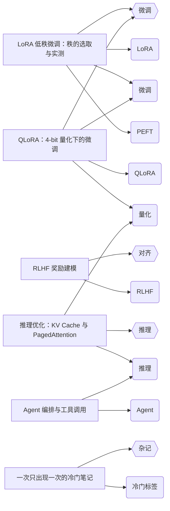

# md-knowledge-graph

从**任意 markdown 目录**的 frontmatter 构建知识图谱——文章、标签、分类三部图，输出 JSON / Mermaid / 自包含 HTML。

[](https://github.com/meiluosi/md-knowledge-graph/actions/workflows/ci.yml)


---

## Result

把 `examples/` 里的 6 篇 markdown 跑一遍，`--format mermaid` 直接输出下面这张图（无需截图，GitHub 原生渲染）：



请特别注意两条边：

- `post:2026-01-08-qlora-4bit --> tag:qlora` —— 这篇文章的 frontmatter 写的是 **行内数组** `tags: [QLoRA, 量化, 微调]`
- `post:2026-01-12-rlhf-reward --> tag:rlhf` —— 这篇写的是 **标量** `tags: RLHF`

**这两种写法，本工具的前身会静默解析成空数组**，文章会从图里无声消失。见 [What didn't work](#what-didnt-work)。

CLI 的统计输出：

```
$ node src/cli.js --posts examples --min-tag-count 1
读取语料：/path/to/examples
完成：6/6 篇文章入图，9/9 个标签，4 个分类，19 个节点，17 条边
```

`--format html` 产出的是一个**自包含、离线可用**的力导向图：单文件、无 CDN、无外部字体，双击即可在浏览器打开，节点可拖拽。

---

## Quickstart

```bash
git clone https://github.com/meiluosi/md-knowledge-graph.git
cd md-knowledge-graph
npm install
npm run example          # → examples/graph.json
```

跑你自己的语料：

```bash
node src/cli.js --posts /path/to/your/notes --out graph.json
node src/cli.js --posts ./content --out graph.html --format html
```

**验收标准：从 clone 到出图，10 分钟以内。** 仓库里自带 `examples/` 语料，所以 Quickstart 不依赖任何私有数据。

## Install

```bash
npm install md-knowledge-graph
npx mdkg --posts ./content --out graph.json
```

要求 Node ≥ 18.3（用到内置的 `node:util` `parseArgs`）。

## 用法

| 选项 | 说明 | 默认 |
|---|---|---|
| `-p, --posts <dir>` | 语料目录，递归读取 `.md` / `.mdx` | `examples` |
| `-o, --out <file>` | 输出文件；省略则写 stdout | — |
| `-f, --format <fmt>` | `json` \| `mermaid` \| `html` | `json` |
| `--min-tag-count <n>` | 标签出现次数低于 n 则不入图 | `2` |
| `--max-nodes <n>` | 节点数上限，超出按「分类全留 + 标签按频次」裁剪 | `200` |
| `--post-url <tpl>` | 文章 URL 模板，如 `/posts/{id}/` | — |
| `--tag-url <tpl>` | 标签 URL 模板，如 `/tags/{slug}/` | — |
| `--category-url <tpl>` | 分类 URL 模板，如 `/categories/{slug}/` | — |
| `--compact` | JSON 输出不缩进 | — |

复刻一个 Astro 站点的 URL 结构：

```bash
node src/cli.js --posts src/content/posts \
  --post-url "/posts/{id}/" --tag-url "/tags/{slug}/" \
  --category-url "/categories/{slug}/" --out graph.json
```

被跳过的内容：没有 `title` 的文件、没有 frontmatter 的文件、`node_modules` 等目录，以及**既无入图标签也无分类的文章**（避免在图里留下孤点）。

## How it works

```
markdown 目录
   │  递归遍历（自带实现，不依赖 glob）
   ▼
gray-matter 解析 frontmatter
   │  normalizeList() 把 数组 / 行内数组 / 标量 收敛成同一种结果
   ▼
构图：post ↔ tag、post ↔ category
   │  minTagCount 过滤长尾 → maxNodes 裁剪
   ▼
JSON  /  Mermaid  /  自包含 HTML
```

图的语义是二部边合成三部图：

- `tag:<slug>` 与 `category:<slug>` 是聚合节点，`count` 记录出现次数
- `post:<相对路径>` 是叶子节点
- 边只有 `post → tag` 和 `post → category` 两类，**不生成 tag ↔ tag 的共现边**

最后一点是个有意的取舍：共现边数量是标签数的平方级，语料一大图就糊。当前实现选择让「同一篇文章」隐式表达共现关系。如果你的场景确实需要显式共现边，这是个明确的扩展点。

## What didn't work

这一节不是装饰。以下是**实际踩过**的坑和实测数据。

### 1. 手写 frontmatter 解析器会静默丢数据

本工具的前身是你现在看到的这个想法的第一版：一个 51 行的、零依赖的手写 YAML 子集解析器（逻辑：遇到 `key:` 空值就进入数组模式，逐行收 `- ` 项；只有 `title` / `category` 被当作标量处理）。

它在我自己的 33 篇文章上**从未出错**——因为那些文章恰好全用了块式数组。换几种同样合法的写法，结果是：

| frontmatter 写法 | 手写解析器结果 | |
|---|---|---|
| `tags:\n  - A\n  - B` | `["A", "B"]` | ✅ |
| `tags: [A, B]` | `[]` | ❌ **静默丢数据** |
| `tags: A` | `[]` | ❌ **静默丢数据** |
| `title: "X: Y"` | `"X: Y"` | ✅ |

问题不在实现粗糙，而在**缺陷形态**：它对非法输入不报错，对合法输入也照样返回空数组。使用者拿到的是一张少了文章、却不报任何错的图。

**所以本项目引入了唯一的依赖 `gray-matter`。** 不是偷懒——是承认「自己维护一个 YAML 子集」这件事的边界成本远高于一个成熟依赖。上面那三种写法现在是三条回归测试（`test/graph.test.js` 的 `normalizeList` 组）。

### 2. 我的第一版测试自己写错了断言

写 `buildGraph` 测试时我断了一条：

```
✖ 有分类但标签全被过滤的文章仍然入图
  AssertionError: 文章 c 应通过分类连入图
```

我构造的测试数据里，那个文章的 `category` 其实是空字符串——所以它本来就该被排除，**是断言错了，不是代码错了**。修正后这条测试才真正测到了它想测的东西（「靠分类这条边留在图里」）。

记在这里是因为它说明了一件事：**测试失败时，先怀疑测试。** 我差点为了让它变绿而去改一个本来正确的实现。

### 3. 生成物也需要被测试

`--format html` 的输出是 HTML，语法正确不代表能跑。一个 NaN 坐标、一个漏掉的 canvas 方法，用户拿到的就是一张白屏，而只做语法检查的 CI 抓不到。

`test/html-runtime.test.js` 因此搭了一个最小 DOM stub，把内嵌脚本**真正执行一遍**，断言每个节点都被绘制、所有坐标都是有限值、画布按 DPR 正确放大。写这个 stub 花的时间，比它拦下的问题便宜。

## 已知取舍

- **不做 tag ↔ tag 共现边**（理由见 How it works）
- **`--min-tag-count > 1` 时，只出现一次的标签会整条消失**，其文章只能靠分类连线；若无分类则不入图
- **Mermaid 输出不适合超过约 100 个节点**，那个规模请用 `--format html`
- **不解析除 frontmatter 之外的内容**：正文里的 `[[wikilink]]` 之类一概忽略

## License

[MIT](./LICENSE)
