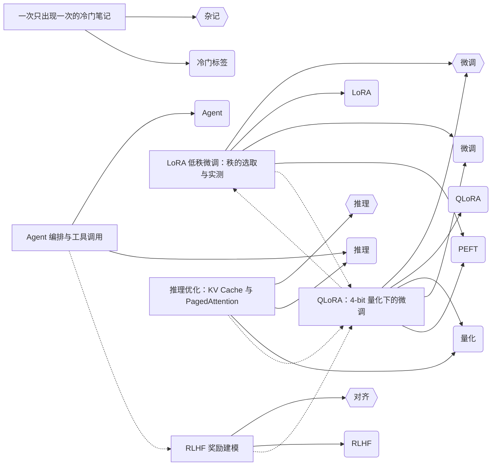

# md-knowledge-graph

**把 markdown 知识库里的「沉默失效」变成 CI 里的一条红灯。**

> ## ⚠️ 先说结论：这个项目没有找到使用者
>
> 它**工程上完成了**（296 条测试 / 4 个 Node 版本 / CI / Action / 6 份文档），
> 但**价值上不成立**：
>
> - 客观可判的那部分（断链、锚点）—— **lychee 早就做了，而且做得更好**
> - 独有的那部分（标签健康度）—— **是我发明的意见，不是事实**
> - 两者的交集是空的
>
> **完整复盘：[`docs/retrospective.md`](./docs/retrospective.md)**
>
> 它仍然可用，也仍然用在写下它的那个博客上（在那里抓到 **19 个真实坏引用**）。
> 它只是没有成为一件对别人有用的东西。**这个判断应该在第一个版本之前就做出来。**

**那你该怎么决定用不用它：**

| 你的需求 | 该用什么 |
|---|---|
| 只要查断链和锚点 | **用 [lychee](https://github.com/lycheeverse/lychee)** |
| 要爬已发布站点的所有链接 | **用 lychee / linkinator** |
| 要看交互式知识图谱 | **用 Obsidian / Quartz** |
| 想要"只挡新增"的 CI 门禁 + 语料结构数据 | 可以看这里（但先读复盘） |

想看带图的三层能力说明与逐项对比 → [`docs/what-is-this.md`](./docs/what-is-this.md)

[](https://github.com/meiluosi/md-knowledge-graph/actions/workflows/ci.yml)
[](https://github.com/meiluosi/md-knowledge-graph/actions/workflows/action-selftest.yml)


---

## 问题：坏掉的引用不会报错

代码写错了，编译器和测试会拦你。**文档写错了，没有任何东西会拦你。**

| 失效类型 | 表面现象 | 实际代价 |
|---|---|---|
| **章节被改名，引用还指着旧锚点** | 文档照常渲染 | 读者点进一个空位置，或跳到页首。链接"看着在"，实际已经死了 |
| **引用的文件被删或改名** | 同上 | 404。常见于重构之后 |
| **图片写成本机路径** `C:\...` | 本地预览完全正常 | **只有发布后才 404**——作者永远看不见 |
| **标签写法前后不一致** | 检索时少一半结果 | 知识库悄悄分成互不相连的两半 |
| **`design.md` 改了，`tasks.md` 没跟** | 没人发现 | 规格与实现悄悄脱节 |

这些失效的共同点是：**它们不会让任何东西崩，只会让读者和同事慢慢不再信任这份文档。**

而随着规格驱动开发的普及，markdown 已经不只是"给人看的文档"——它是需求、设计、任务清单，也是 agent 的输入。**它变成了协作接口，而接口的正确性目前没人守。**

## 它做的三件事

```bash
mdkg --posts ./content --check                      # 检查（退出码可进 CI）
mdkg --posts ./content -o graph.json                # 知识图谱
mdkg --posts ./content -f related -o related.json   # 相关文章数据
```

**接入成本接近零**：不改内容、不加 frontmatter、不需要先 build。纯 markdown（规格文档、普通文档）直接可用；带 frontmatter 的博客同样可用。一行命令，或一个 GitHub Action，或一个 pre-commit 钩子。

## 为什么它不会像多数检查工具一样被关掉

**这是这个项目最花力气的部分。**

检查工具的死法不是"查不出问题"，而是两个具体场景：

**场景一：一开就红。** 一个攒了 40 条历史问题的知识库，第一次跑就拿到 40 个错误。没人会去修那 40 条——**他会在 CI 里删掉这一步。**

→ 对策：**基线**。把已知问题冻结成一份可 review 的 JSON，之后**只有新增问题才失败**。

```bash
mdkg --posts content --update-baseline .mdkg-baseline.json   # 接入时做一次
mdkg --posts content --check --baseline .mdkg-baseline.json  # 之后一直用
```

```
✓ 没有新增问题（40 项已知问题仍在基线里）          ← 退出码 0
✗ 正文断链 —— 1 项（另有 1 项已知，已忽略）        ← 后来引入的新问题
    new  →  ./nope.md                              退出码 1
```

**场景二：误报。** 用户发现里面有两条是假问题，就不再信任它，然后关掉。

→ 对策：**宁可漏报，不可误报。**
- 链接目标同名歧义时，判定为"解析不出"，**绝不猜一个**
- 判不了的不判：外链图片、站点绝对路径默认不检查（除非你给出 `--asset-root`）
- 连示例语料里的**有效**锚点和代码块**假**锚点都有对照测试，确保不被报出来

**规则不适合我怎么办？** 用 `mdkg.config.json` 逐条开关，而不是关掉整个门禁：

```json
{ "posts": "content", "assetRoot": "public",
  "rules": { "singleton-tag": "off", "broken-anchor": "error" } }
```

`mdkg --list-rules` 列出全部 11 条规则与当前生效级别。

## 能查出什么

**注意"是事实还是意见"这一列——它是这个项目最重要的自我说明。**

| 检查项 | 类型 | 级别 | 典型场景 |
|---|---|---|---|
| 正文断链 | **事实** | 错误 | 引用的文件被删或路径写错 |
| 失效锚点 | **事实** | 错误 | `[契约](design.md#api-contract)` —— 章节改名了，文件还在，链接已经死了 |
| 本地文件系统路径 | **事实** | 错误 | `` —— 本机路径在网页上必然打不开 |
| 图片文件不存在 | **事实** | 错误 | 相对路径的图片已被删除或改名 |
| frontmatter 解析失败 | **事实** | 错误 | YAML 语法错误 |
| 有 frontmatter 但没写 title | 半事实 | 警告 | 违反了你自己用 frontmatter 的这个约定 |
| 标签写法不一致 | 半事实 | 警告 | `PEFT` 与 `peft` 会合并成同一个节点 |
| 无标签的文章 | ⚠️ **意见** | 警告 | 很多博客就是有意不打标签 |
| 只出现一次的标签 | ⚠️ **意见** | 警告 | `QLoRA`、`Apple Silicon` 只出现一次完全合理 |
| 图中的孤立节点 | ⚠️ **意见** | 警告 | 纯信息，算不算问题由你定 |
| 文章引用了自己 | ⚠️ **意见** | 警告 | 可能是有意的 canonical 链接 |

> **那 4 条"意见"是我的判断，不是事实。** 我把它们设成了默认警告——这等于替你做决定，
> 而我没有你的项目上下文。**不认同就关掉**（见 [复盘](./docs/retrospective.md) 里的配置示例），
> 或者用 `mdkg --list-rules` 看哪些被标了「意见，非事实」。

每条都精确到**行号**——文本报告是 `file:line`，GitHub 注解落在同一行。

## 快速接入

**GitHub Action**（不需要先 `npm install`）：

```yaml
- uses: meiluosi/md-knowledge-graph@v0.8.0
  with:
    posts: content
    baseline: .mdkg-baseline.json   # 可选
```

问题会**直接挂在 PR 的 *Files changed* 里对应文件的那一行上**，不必翻 CI 日志：

```
::error file=content/design.md,line=42,col=7,title=失效锚点::tasks  →  design  #api-contract
```

返回 `errors` / `warnings` / `known` 三个输出，并写 GITHUB_STEP_SUMMARY 表格。

**pre-commit**：

```yaml
repos:
  - repo: https://github.com/meiluosi/md-knowledge-graph
    rev: v0.8.0
    hooks: [ { id: md-knowledge-graph, args: [--posts, content, --check] } ]
```

钩子用 `pass_filenames: false`——本工具需要**整份语料**才能判断链接指向是否存在，只给改动过的文件是判不了的。

**任意 CI**：`npx md-knowledge-graph --posts content --check --baseline .mdkg-baseline.json`

## 真实效果

在一份**真实的技术博客**上跑（33 篇 / 19,673 行，从 git 历史导出）：

```
$ mdkg --posts src/content/posts --check
✗ 本地文件系统路径（在网页上必然打不开） —— 19 项
    2024-06-09-关于数据分析思考:129  →  C:\Users\...\image-20240522194214888.png  (image)
错误 19 · 警告 8  → 存在错误，退出码 1
```

**19 个坏引用，此前一直"显示正常"。** 全都只在发布后才会 404——作者本地看是好好的。

同一份语料还暴露了一个结构问题：`post↔post` 引用边 = **0**。33 篇文章有标签、有分类、68 条归属边，看起来结构完整，但把标签层拿掉，就是 33 个互不相连的点。

完整记录见 [`docs/case-study.md`](./docs/case-study.md)。**那次验证还撞出了两个漏报 bug**——包括工具曾把 `C:` 当成 URL 协议，导致这 19 条引用被静默跳过。

运行成本：**33 篇 / 19,673 行 = 0.064 秒**。挂进 pre-commit 没有负担。

## 与现有工具的差别

**先说清楚它不是什么：它不是一个更好的链接检查器。**

| 能力 | [lychee](https://github.com/lycheeverse/lychee) | linkinator | Obsidian / Quartz | **mdkg** |
|---|---|---|---|---|
| 断链（本地 + HTTP） | ✅ | ✅ | — | ✅ |
| **锚点（章节是否存在）** | ✅ `--include-fragments` | ❌ | 应用内提示 | ✅ |
| wikilink | ✅ `--include-wikilinks` | ❌ | ✅ | ✅ |
| **需要先 build** | ❌ | **✅ 需要** | — | ❌ |
| **需要迁移内容** | ❌ | ❌ | **✅ 要迁进 vault** | ❌ |
| **标签体系检查** | ❌ 没有"标签"概念 | ❌ | 应用内 | ✅ |
| **按问题实例的基线** | ⚠️ 只有按模式排除 | ❌ | — | ✅ |
| **产出图 / 相关文章数据** | ❌ 只做检查 | ❌ | 页面（不给数据） | ✅ |
| 成熟度 / 性能 | **Rust，非常成熟** | 成熟 | 成熟 | 个人项目 |

**锚点检查不是我们的差异点**——lychee 也会解析 markdown 标题做锚点检查。真正独有的只有三件：

1. **标签体系的健康度** —— lychee 根本不知道"标签"是什么。而标签一旦写法不一致（`PEFT` / `peft`），检索就会悄悄少一半结果。
2. **按问题实例的基线** —— lychee 的 `--exclude-file` 是按 **URL 模式**排除：为了压住一条历史债，会连**同类的新问题**一起静默排除。基线是**按实例**冻结，新问题仍然失败。
3. **一次产出三种数据** —— 图、检查报告、相关文章 JSON，可以直接喂给博客或别的工具。

**它和 lychee 是互补的，不是替代关系。** 同一个仓库里同时跑两个完全合理。

完整的能力分层、以及**什么时候不该用它**，见 [`docs/what-is-this.md`](./docs/what-is-this.md)。

## 输出

<details>
<summary><b>知识图谱</b>（点击展开 —— 实线是归属，虚线是引用）</summary>



</details>

**检查报告**（示例语料故意留了缺陷，这段真实可复现）：

```
$ mdkg --posts examples --check
✗ 正文断链（目标文件不存在） —— 1 项
    2026-01-08-qlora-4bit:23  →  ./2026-01-01-deleted-draft.md
✗ 失效锚点（文件存在，但章节不存在） —— 2 项
    2026-01-08-qlora-4bit:30  →  2026-01-15-inference-kvcache  #flash-attention
    2026-01-08-qlora-4bit:32  →  （本文）  #不存在的小节
✗ 本地文件系统路径（在网页上必然打不开） —— 1 项
    2026-01-22-rare-note:24  →  C:\Users\someone\Pictures\shot.png  (image)
✗ 图片文件不存在 —— 1 项
    2026-01-22-rare-note:28  →  ./assets/missing-diagram.png
⚠ 只出现一次的标签 —— 5 项
⚠ 写法不一致的标签 —— 1 项     PEFT / peft  →  合并为「peft」，共 2 篇
错误 5 · 警告 6  →  退出码 1
```

同一份语料里还有**有效**锚点（`#kv-cache`、`#pagedattention`、`#react`）和代码块里的**假**锚点——两者都不会被报出来。这是刻意的。

**相关文章**（带 `schemaVersion`，可直接给博客的「相关阅读」消费）：

```json
{ "schemaVersion": 1, "posts": [ { "id": "agent-orchestration", "related": [
  { "id": "rlhf-reward", "score": 3, "reasons": ["link"] },
  { "id": "inference-kvcache", "score": 2, "reasons": ["tag:推理"] } ] } ] }
```

打分：正文引用 +3 / 被引用 +3 / 每个共享标签 +2 / 同分类 +1。同分按 id 升序，**顺序确定**——否则每次跑出来的"相关阅读"都在变，没法对比。

`--format html` 另有一个自包含、离线可用的力导向图（单文件、无 CDN、可拖拽），适合当调试预览。

## 用法

| 选项 | 说明 | 默认 |
|---|---|---|
| `-p, --posts <dir>` | 语料目录，递归读取 `.md` / `.mdx` | `examples` |
| `-o, --out <file>` | 输出文件；省略则写 stdout | — |
| `-f, --format <fmt>` | 出图：`json`/`mermaid`/`html`/`related`；检查：`text`/`json`/`github` | `json` / `text` |
| `-c, --config <file>` | 指定配置文件（默认自动发现 `./mdkg.config.json`） | — |
| `--list-rules` | 列出全部检查项与当前生效级别 | — |
| `--min-tag-count <n>` | 标签出现次数低于 n 不入图 | `2` |
| `--max-nodes <n>` | 节点数上限 | `200` |
| `--no-link-edges` / `--no-anchor-check` | 关掉引用边 / 关掉锚点校验 | — |
| `--asset-root <dir>` | 站点静态资源根目录，用于检查 `/img/...` | — |
| `--post-url` / `--tag-url` / `--category-url` | URL 模板，如 `/posts/{id}/` | — |
| `--check` / `--strict` | 只跑检查；`--strict` 让警告也算失败 | — |
| `--baseline <file>` | 只对**新增**问题失败 | — |
| `--update-baseline <file>` | 把当前全部问题写成基线（**会接受新问题**） | — |
| `--prune-baseline <file>` | 只删除基线里已修好的条目，**绝不添加** | — |

**退出码**：`0` 正常或检查无新增错误；`1` 参数/语料错误，或检查发现新增错误。

**优先级**：命令行 > `mdkg.config.json` > 默认值。

## What didn't work

完整版见 [`docs/what-didnt-work.md`](./docs/what-didnt-work.md)——**11 条真实踩坑**。最值得记的四条：

- **手写 frontmatter 解析器静默丢数据**：`tags: [A, B]` 和 `tags: A` 都变成 `[]`，且不报错。这就是引入 `gray-matter` 的原因。
- **`C:` 被当成 URL 协议**：真实语料上漏报 19 条本机路径引用。它是**漏报**——工具对着一批坏引用说"没问题"，那比没有工具更坏。
- **工具在它声称的主要场景上跑不起来**：规格文档通常没有 frontmatter，而早先版本会跳过这类文件，导致对一整个 spec 仓库的结论是"没有找到 markdown"。这是**定位 bug，不是代码 bug**——每条功能都"在"，只是合起来到不了目标场景。
- **同概念两种写法产出畸形图**：`PEFT` 与 `peft` 曾生成两个 **id 相同**的节点。修复后又发现检查器用了另一套口径——**它一边警告"会合并"，一边按两种拼写各报一次**。

## 工程细节

- **测试 296 条**，Node 18 / 20 / 22 / 24 矩阵全绿；两条工作流（CI + Action 自检）
- Action 自身也被测试——**一个坏掉的 action 只能在使用者的 CI 里被发现**
- 退出码有子进程级测试——**单元测试全绿但退出码错了，CI 依然是坏的**
- 生成物也被测试：HTML 在 stub DOM 下真跑；注解与文件实际内容**逐行核对**
- **本项目自己的 `docs/` 由本工具检查**，且这一步在 CI 里

**已知取舍**

- 不做 `tag ↔ tag` 共现边（数量是标签数的平方级，语料一大图就糊）
- 链接目标同名歧义时**宁可判为断链**，也不猜一个
- 锚点按 **GitHub 的 slug 规则**（`github-slugger`，参考实现）；渲染器不同请用 `--no-anchor-check`。不覆盖 HTML 手写的 `<h2 id="...">`；支持 Setext 标题
- Mermaid 输出不适合超过约 100 个节点，那个规模用 `--format html`
- 不发起网络请求验证外部链接（那是 lychee 的领域）
- **依赖说清楚**：2 个直接依赖，安装后共 **11 个依赖包**。`github-slugger` 零传递依赖；`gray-matter` 带进 9 个传递依赖

**演进已冻结。** 路线、明确不做什么、以及**什么时候算做完**，见 [`docs/roadmap.md`](./docs/roadmap.md)。
这个项目的终点在采纳里，不在代码里。

## License

[MIT](./LICENSE)
