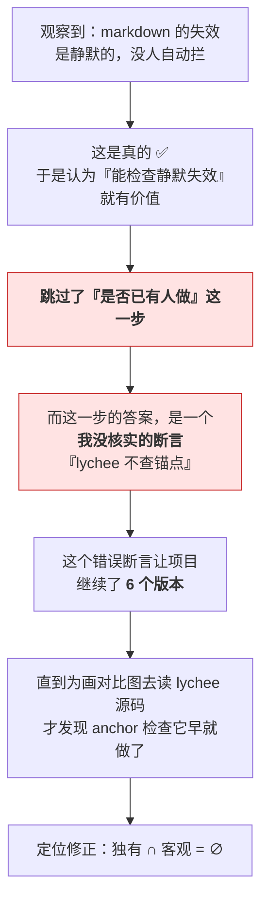

# 复盘：一个不成功的项目

这份文档是收尾。**它记录的不是功能，而是一次判断失误的完整链路。**

写它是因为：绝大多数项目不会留下"我们试过什么、在哪一步走错、为什么最终停下"。而这恰好是最难从别人那里学到的东西。

---

## 结论

> **工程上是完成的，价值上是不成立的。**

这两件事在过程中长得一模一样——都是"又推进了一步"。所以它在 6 个版本里都没有被自己发现。

---

## 事实

| | |
|---|---|
| 代码 | 2,600+ 行源码 / 2,900+ 行测试 |
| 测试 | 296 条，Node 18 / 20 / 22 / 24 矩阵全绿 |
| 工作流 | CI + Action 自检 |
| 文档 | 6 份，约 1,600 行 |
| 检查项 | 11 条，可逐条配置 |
| 集成 | GitHub Action / pre-commit / 任意 CI |
| **外部使用者** | **0** |

最后一行是关键。

---

## 根因链

失败不是某一步做错了，是**一条单向的因果**：



**一个未核实的断言，支撑了 6 个版本。**

而且它有一个特别的坏处：**它让后续每一步都看起来是合理的。**

---

## 三个本该发现的机会

| 时机 | 本该做什么 |
|---|---|
| 第一次写"与现有工具的差别" | **去读 lychee 的源码**（成本：10 分钟） |
| 第一次被问"这有什么价值" | 承认自己只有**直觉**，没有证据 |
| 写"价值论证"那一节时 | 发现四条论据里三条是断言、一条是错的 |

三次机会，都错过了。原因是同一个：

> **那句断言听起来合理，而且吻合我想讲的故事。**

---

## 做错的

### 1. 用"意见"填充价值 ⚠️ 最严重

11 条检查项里，**4 条是我发明的意见**（无标签算不算问题、标签用一次算不算问题、孤立算不算、自引用算不算）。

而我把它们设成了**默认的"警告"**——和客观错误出现在同一个通道、参与同一个退出码。

> **我给意见穿上了事实的外套。**

这不是疏忽。是因为：把主观规则做成默认警告之后，工具的"发现能力"看起来更强了。

### 2. 未核实就写竞品断言

见上。

### 3. 把"工程完成度"当成了"价值"

296 条测试、4 个 Node 版本、两条工作流、6 份文档——**这些全部与"有没有人需要"无关。**

但它们给人强烈的"在推进"的感觉。而**这种感觉本身会掩盖定位问题**。

### 4. 验证得太晚

真正推翻它的是两个偶然：

- 要在真实语料上跑（撞出漏报 bug，也撞出"33 篇零引用"）
- 要画对比图（去读源码，发现断言是错的）

**两次都不是计划内的验证。** 计划内的验证从未质疑过核心前提。

---

## 做对的

不是说全都是错的：

| | |
|---|---|
| **筛子本身** | 判断该不该造工具的 5 条判据，是这段过程里最可复用的产出 |
| **每个 bug 都留了记录** | 12 条踩坑，全部真实，含"工具声称的场景自己跑不了" |
| **一次真实的语料验证** | 在那份博客上抓到 19 个真实坏引用——**这是它实际产生过的唯一价值** |
| **做了否定实验** | 面对"用数学填价值"的诱惑，先花一个下午验证，而不是先写实现 |
| **在文档里更正自己** | 发现断言错了就改，包括在 release 里明说 |

最后两条尤其重要：**它们都没有让项目"更好看"。**

---

## 最深的教训

> **工程完成度可以凭意志力推进；价值不能。**
>
> 而两者在过程中长得一模一样——都是"又推进了一步"。

推论有三条：

**1. 越是吻合自己想讲的故事，越要查。**
那句竞品断言之所以活到第 6 版，正是因为它让故事更完整。

**2. 验证的核心前提，要按"如果它是错的会怎样"来选。**
我验证了很多东西：命令能跑、退出码对、注解格式合法、锚点算得准。
**但没有验证"有没有人已经做了，而且做得更好"。** 而那一条错了，其他全白做。

**3. 先测再做，只在验证成本低时可行——所以低成本的验证必须优先做。**
否定 FCA 只花了一个下午。**如果它需要两周，我大概会直接开始写。**

---

## 可复用的产出

工具本身价值有限，但这四份东西的复用范围超出它：

| 产出 | 讲什么 | 复用范围 |
|---|---|---|
| [`when-to-build-a-tool.md`](./when-to-build-a-tool.md) | 该不该造这个工具的 5 条判据 | **任何工具决策** |
| [`what-didnt-work.md`](./what-didnt-work.md) | 12 条真实踩坑 | 任何工程项目 |
| [`case-study.md`](./case-study.md) | 一次真实语料验证的完整方法 | 任何"我造的东西在真实数据上成立吗"的问题 |
| [`fca-experiment.md`](./fca-experiment.md) | 怎么体面地否定自己的方向 | **最难的部分** |

如果这个项目只留下一份东西，我希望是**最后一份**。

---

## 实用的收尾：只要事实的配置

如果你（或任何人）只想用它做**客观可判**的事，把 4 条意见关掉：

```json
{
  "posts": "content",
  "rules": {
    "untagged": "off",
    "singleton-tag": "off",
    "orphan": "off",
    "self-link": "off"
  }
}
```

`mdkg --list-rules` 会标出哪几条是意见。

**剩下的恰好就是客观的部分**：断链、失效锚点、本地路径、缺失图片、frontmatter 解析失败、标签写法合并——以及 `--asset-root` 下的图片检查。

但要诚实说：**这一半与 lychee 重叠。** 如果用 lychee 就够了，那就用 lychee。

---

## 最后

这个项目停在 **v1.0.0**——不是"成功的 1.0"，是**"完成并冻结的 1.0"**。

它仍然可用，也仍然会用在写下它的那个博客上（它在那里抓到了 19 个真实坏引用）。

**它只是没有成为一件对别人有用的东西。** 而这个判断，应该在第一个版本之前就做出来。
