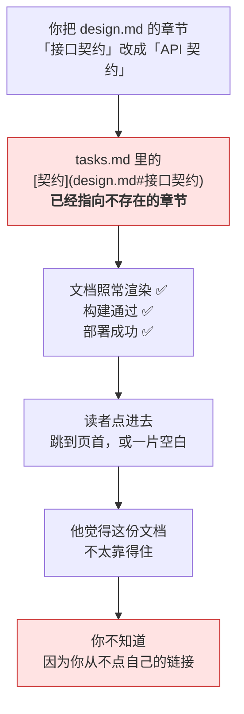
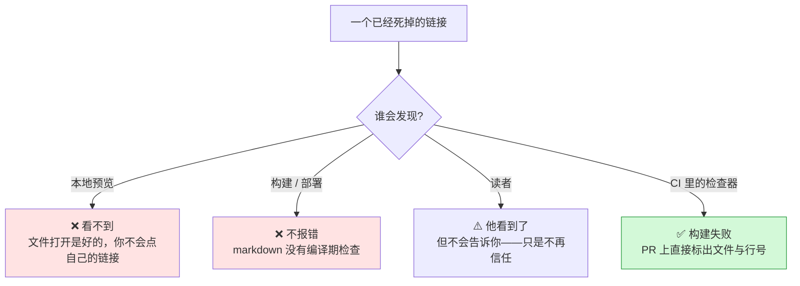
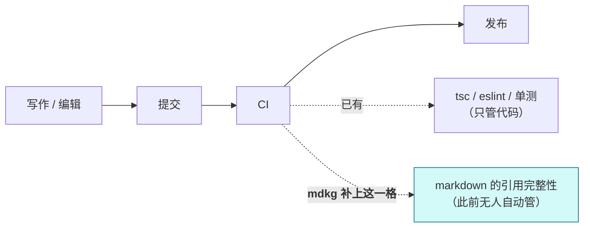
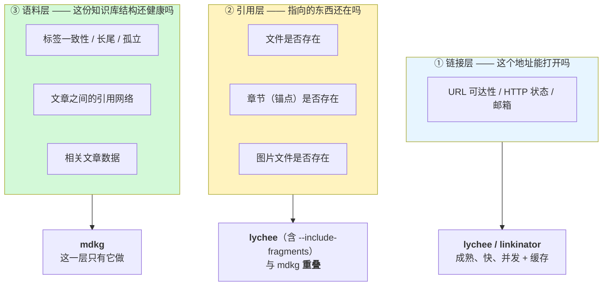

# 这个工具到底是什么

这份文档用图回答三个问题：**它解决什么**、**它和其他工具有什么不同**、**什么时候不该用它**。

> **一句话**：它是一个 markdown 知识库的**数据层 + 门禁**。
> 不是"更好的链接检查器"——链接检查已经有更成熟的工具了。

---

## 一、它解决的是什么问题

### 图 1：一次静默失效的完整生命周期

**关键在 B 到 C 这一段**：一个已经坏掉的引用，在整条流水线上**一路绿灯**。

### 图 2：谁能拦住它

**四个可能的发现点，前三个都不工作。** 这是整件事的重点：

> 这不是"少了一个检查"，而是**没有任何自动化的拦截点**。
> 代价不是报错，是**信任的缓慢流失**——而且你收不到任何反馈。

### 为什么现在更值得管

markdown 已经不只是"给人看的文档"：需求、设计、任务清单、`AGENTS.md`，也是 agent 的输入。

**它变成了协作接口。** 接口需要完整性保障——代码有 `tsc`、`eslint`、单测，markdown 此前什么都没有。

---

## 二、它和其他工具的关系

### 图 3：按"关心的层级"看

**必须说清楚的地方**：第 ② 层 —— 这是本工具原先主打的差异 —— **lychee 也做**。它会解析 markdown 标题做锚点检查，也支持 `--include-wikilinks`。

**真正的独有部分是第 ③ 层**，以及下面的基线机制。

### 诚实的对比

| 能力 | lychee | linkinator | Obsidian / Quartz | Hugo `.Related` | **mdkg** |
|---|---|---|---|---|---|
| 断链（本地 + HTTP） | ✅ | ✅ | — | — | ✅ |
| **锚点（章节）** | ✅ `--include-fragments` | ❌ | 应用内提示 | ❌ | ✅ |
| wikilink | ✅ `--include-wikilinks` | ❌ | ✅ | ❌ | ✅ |
| 本地文件 / 图片存在 | ✅ | ✅ | — | — | ✅ |
| 需要先 build | ❌ | **✅ 需要** | — | — | ❌ |
| 需要迁移内容 | ❌ | ❌ | **✅ 要迁进 vault** | ❌ | ❌ |
| **标签体系检查** | ❌ 没有"标签"概念 | ❌ | 应用内 | ❌ | ✅ |
| **按问题实例的基线** | ⚠️ 只有按模式排除 | ❌ | — | — | ✅ |
| **产出图 / 相关文章数据** | ❌ 只做检查 | ❌ | 页面（不给数据） | ⚠️ 框架内 | ✅ |
| 成熟度 / 性能 | **Rust，非常成熟** | 成熟 | 成熟 | 成熟 | 个人项目 |

### 基线到底差在哪

这不是"有没有忽略功能"，而是**粒度**：

| | lychee `--exclude-file` | mdkg 基线 |
|---|---|---|
| 粒度 | URL / 路径**模式** | 问题**实例**（带指纹） |
| 新出现的同类问题 | 一起被静默排除 | **仍然失败** |
| 已修好的 | 需要手动删规则 | 自动识别并提示清理 |

> 模式排除的问题是：你为了压住一条历史债，关掉了一整类 URL——**以后同类的新问题也不会再报。**

---

## 三、那它到底值什么

**不是"更会查链接"，而是这三件 lychee 做不了的事：**

1. **标签体系的健康度。** lychee 根本不知道"标签"是什么。而标签一旦写法不一致（`PEFT` / `peft`），检索就会悄悄少一半结果。
2. **门禁活得下去。** 基线按问题实例冻结，只挡新增；能识别哪些已经修好。
3. **一次产出三种数据。** 图、检查报告、相关文章 JSON——可以直接喂给博客或别的工具。lychee 只做检查。

### 什么时候**不该**用它

这一节比上面都重要：

| 你的需求 | 该用什么 |
|---|---|
| 只要查断链和锚点 | **用 lychee**。更成熟、更快、Rust 写的 |
| 要爬一个已发布站点的所有链接 | **用 lychee / linkinator** |
| 想看交互式的知识图谱 | **用 Obsidian / Quartz**。这条我们早就放弃了 |
| 想要框架内建的"相关文章" | 用你框架自带的（Hugo `.Related`） |
| **要判断这份 markdown 语料的结构是否健康** | mdkg |
| **要在 CI 里守住引用完整性，且不想一开就红** | mdkg |
| **要把语料结构当数据用（图 / 相关文章）** | mdkg |

**它和 lychee 是互补的，不是替代关系。** 在同一个仓库里同时跑两个，是完全合理的。

---

## 四、一句话总结

> **lychee 回答「链接能不能打开」。**
> **mdkg 回答「这份知识库的结构还对不对」，并且把结构本身当作数据产出。**

第 ① 层已经有人做得很好，不需要第二个。这个项目的赌注押在**第 ③ 层**——
以及一个更朴素的前提：**一个检查工具只有不被关掉，才有价值。**
